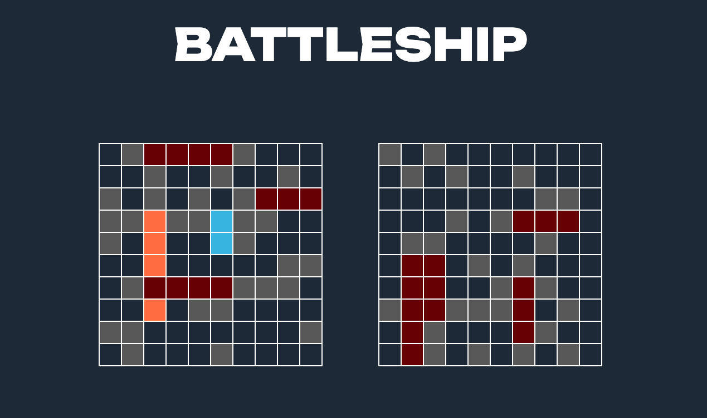

# Battleship

Want to try your prowess in naval warfare?

[Play Battleship!](https://mrzadzinski.github.io/to-do-list/)

## Features
* Intelligent AI opponent
* Manual or random fleet deployment
* Intuitive color indications

## Technologies
* JEST
* Webpack
* Javascript
* SCSS
* HTML

## Skills practiced
* Test Driven Development (basics tests in JEST)
* Working with modules
* Designing user friendly app

## Acknowledgments
* This project was an assignment from The Odin Project course: [Battleship](https://www.theodinproject.com/lessons/node-path-javascript-battleship)